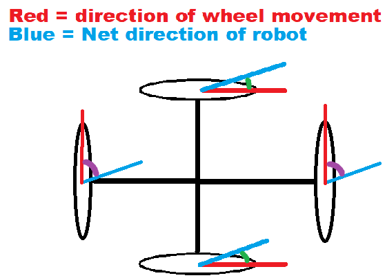

# SLAMurai Autonomous Robot

This project is an open-source implementation of a SLAM (Simultaneous Localization and Mapping) robot.
All CAD and software is contained within this repo.

## Features

- Real-time mapping
- Autonomous navigation

&nbsp;

# Detailed Robot Design
### Payload:
- 4x motors: 0.25kg each = 1.0kg total
- 4x 100mm omni wheels: 0.3kg each = 1.2kg total
- 1x 6000mAh battery: 0.55kg
- 1x NVIDIA TX2: 0.5kg
- 1x Intel RealSense D455: 0.3kg
- 3x chassis plates: 0.3kg total
- 1x LIDAR: 0.2kg

**Total weight: 4.5kg rounded**

### Desired robot specs:
- Speed: 0.75 m/s
- Acceleration: 0.3 m/s²
- Max payload: 4.5 kg (just the total robot weight)
- Wheels: 100mm omni wheel in 90° configuration (two motors drive the robot forward, two motors drive the robot sideways)
- Worst case surface: Concrete (Rolling resistance ~0.03)
- Torque safety factor: 2

### Selecting Motor Parameters:

**Forces due to rolling resistance and desired acceleration:**

```math
\text{F}_{\text{roll}} = \mu \cdot \text{F}_{\text{normal}} = 0.03 \cdot 4.5 \text{kg} \cdot 9.81 \text{m/s}^2 = 1.32 \text{N}
```

```math
\text{F}_{\text{accel}} = 4.5 \text{kg} \cdot 0.3 \text{m/s}^2 = 1.35 \text{N}
```

```math
\text{F}_{\text{total}} = 1.32 \text{N} + 1.35 \text{N} = \boxed{2.67 \text{N}}
```

```math
\text{Required torque and RPM:} \\\\
\tau = \text{F}_{\text{total}} \cdot \text{r}_{\text{wheel}} = 2.67 \text{N} \cdot 0.05 \text{m} = \boxed{0.134 \text{Nm}}
```

This gives us the total torque required for the robot. However, we need the **worst-case torque per motor** to maintain the desired acceleration. One might assume it splits evenly between two motors when moving forward/backward or left/right. But could diagonal movement need more?



If each motor provides torque $T$, the top/bottom motors contribute $2 T \cos(\theta)$ and left/right motors $2 T \cos(90^\circ - \theta)$, where $\theta$ is the angle of travel. We can solve for $T$ to achieve some total torque $\tau$:

```math
\tau = 2 T \cos(\theta) + 2 T \cos(90^\circ - \theta)
```

```math
T = \frac{\tau}{2 (\cos(\theta) + \sin(\theta))}
```

$T$ peaks when $\cos(\theta) + \sin(\theta)$ is minimized. We only consider $0 \leq \theta \leq 90^\circ$ since if the angle is $> 90^\circ$, we need to switch the direction of the top/bottom motors, yielding an angle $0 \leq \theta \leq 90^\circ$ again. Therefore the maximum of $T$ occurs when $\theta = 0^\circ$ or $90^\circ$. So yes, the worst case is moving purely along the top/bottom or left/right axes, splitting torque evenly:

```math
T = \frac{\tau}{2} = \frac{0.134 \text{Nm}}{2} = \boxed{0.067 \text{Nm}} \cdot 2_\text{(safety factor)} \approx \boxed{0.134 \text{Nm worst case per motor}}
```

```math
0.134 \text{Nm} \cdot \frac{10.197 \text{kg*cm}}{1 \text{Nm}} \approx \boxed{1.37 \text{kg*cm}}
```

Then for required RPM:

```math
\text{RPM} = \frac{\text{Target velocity} \cdot 60}{2 \pi r} = \frac{0.75 \text{m/s} \cdot 60}{2 \pi \cdot 0.05 \text{m}} \approx \boxed{143.24 \text{RPM}}
```

```math
\boxed{\text{So we need motors with at least 0.134 Nm torque and 143 RPM}}
```

## License

MIT License
