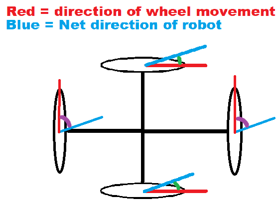
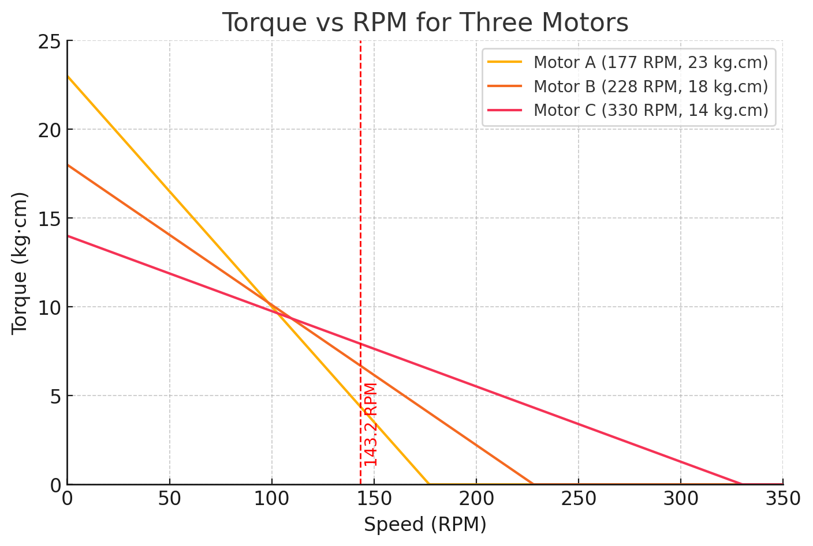
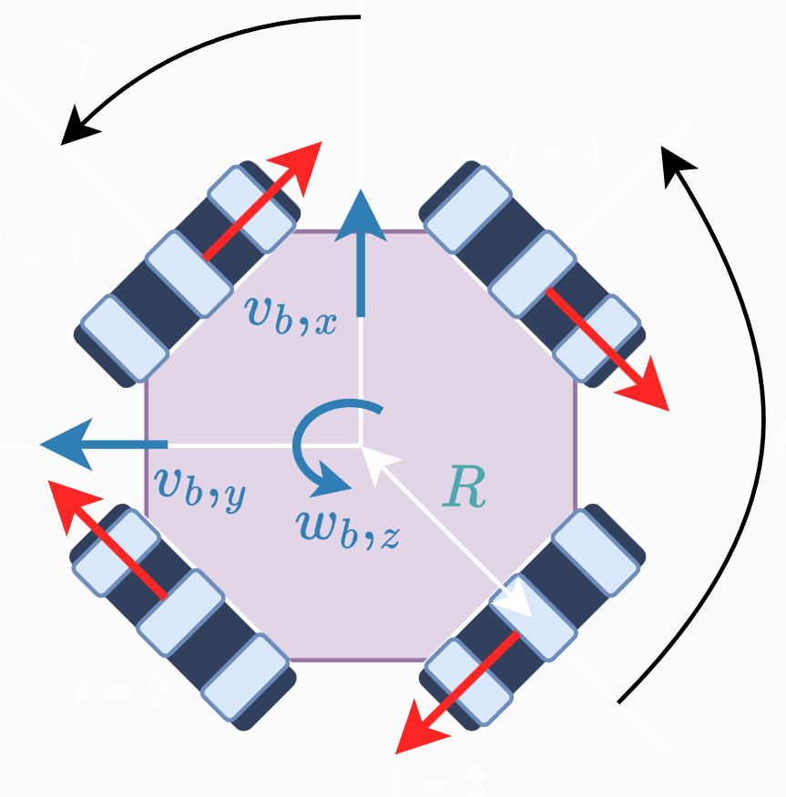

# SLAMurai Autonomous Robot

This project is an open-source implementation of a SLAM (Simultaneous Localization and Mapping) robot.
All CAD and software is contained within this repo.

## Features

- Real-time mapping
- Autonomous navigation

&nbsp;

# Detailed Robot Design
### Payload:
- 4x motors: 0.25kg each = 1.0kg total
- 4x 100mm omni wheels: 0.3kg each = 1.2kg total
- 1x 6000mAhlipo battery: 0.55kg
- 1x NVIDIA TX2: 0.5kg
- 1x Intel RealSense D455: 0.3kg
- 3x chassis plates: 0.3kg total
- 1x LIDAR: 0.2kg

**Total weight: 4.5kg rounded**

### Desired robot specs:
- Speed: 0.75 m/s
- Acceleration: 0.3 m/s²
- Max payload: 4.5 kg (just the total robot weight)
- Wheels: 100mm omni wheel in 90° configuration (two motors drive the robot forward, two motors drive the robot sideways)
- Worst case surface: Concrete (Rolling resistance ~0.03)
- Torque safety factor: 2

## Selecting Motor Parameters:
#### Required torque:

```math
\text{F}_{\text{roll}} = \mu \cdot \text{F}_{\text{normal}} = 0.03 \cdot 4.5 \text{kg} \cdot 9.81 \text{m/s}^2 = 1.32 \text{N}
```

```math
\text{F}_{\text{accel}} = 4.5 \text{kg} \cdot 0.3 \text{m/s}^2 = 1.35 \text{N}
```

```math
\text{F}_{\text{total}} = 1.32 \text{N} + 1.35 \text{N} = \boxed{2.67 \text{N}}
```

```math
\tau = \text{F}_{\text{total}} \cdot \text{r}_{\text{wheel}} = 2.67 \text{N} \cdot 0.05 \text{m} = \boxed{0.134 \text{Nm}}
```

This gives us the total torque required for the robot to meet our acceleration target. However, we need the **worst-case torque per motor**. One might assume it splits evenly between two motors when moving forward/backward or left/right. But could diagonal movement need more?

<p align="center"></p>

If each motor provides torque $T$, the top/bottom motors contribute $2 T \cos(\theta)$ and left/right motors $2 T \cos(90^\circ - \theta)$, where $\theta$ is the angle of travel. We can solve for $T$ to achieve some total torque $\tau$:

```math
\tau = 2 T \cos(\theta) + 2 T \cos(90^\circ - \theta)
```

```math
T = \frac{\tau}{2 (\cos(\theta) + \sin(\theta))}
```

$T$ peaks when $\cos(\theta) + \sin(\theta)$ is minimized. We only consider $0 \leq \theta \leq 90^\circ$ since if the angle is $> 90^\circ$, we need to switch the direction of the top/bottom motors, yielding an angle $0 \leq \theta \leq 90^\circ$ again. Therefore the maximum of $T$ occurs when $\theta = 0^\circ$ or $90^\circ$. So yes, the worst case is moving purely along the top/bottom or left/right axes, splitting torque evenly:

```math
T = \frac{\tau}{2} = \frac{0.134 \text{Nm}}{2} = \boxed{0.067 \text{Nm}} \cdot 2_\text{(safety factor)} \approx \boxed{0.134 \text{Nm worst case per motor}}
```

```math
0.134 \text{Nm} \cdot \frac{10.197 \text{kg*cm}}{1 \text{Nm}} \approx \boxed{1.37 \text{kg*cm}}
```

#### Then for required RPM:

```math
\text{RPM} = \frac{\text{Target velocity} \cdot 60}{2 \pi r} = \frac{0.75 \text{m/s} \cdot 60}{2 \pi \cdot 0.05 \text{m}} \approx \boxed{143.24 \text{RPM}}
```

```math
\boxed{\text{So we need motors with at least 0.134 Nm torque and 143 RPM}}
```

## Motor Selection
I searched for a while and I either found motors with too low torque, or shipped from China and costed a fortune. Perhaps worse, motors on Amazon are reasonably priced and free shipping, but the vendors despise listing torque (much less spec sheets) for some reason.

Eventually I found [this motor](https://www.amazon.com/CQRobot-Ocean-6V-3W-20RPM-40-oz-12V-6W-40RPM-70/dp/B08ZK6QCCL/ref=pd_ci_mcx_di_int_sccai_cn_d_sccl_2_1/138-6137927-8750040?pd_rd_w=Zg5pj&content-id=amzn1.sym.751acc83-5c05-42d0-a15e-303622651e1e&pf_rd_p=751acc83-5c05-42d0-a15e-303622651e1e&pf_rd_r=95C2GMX20CP7G5X6CPWA&pd_rd_wg=w4uHO&pd_rd_r=e108f911-329a-4624-8c83-7a904740f90a&pd_rd_i=B08X3CDZRF&th=1) which boasts many configurations, and their 177RPM seemed pretty good for $34. They only list stall torque as 23kg*cm and no-load speed as 177RPM, but that's actually enough to calculate the torque at any RPM, since torque decreases linearly with RPM:

```math
\tau_{\text{at RPM}} = \frac{\tau_{\text{stall}} - 0}{0 - \text{No-load RPM}} \cdot \text{RPM} + \tau_{\text{stall}}
```
```math
\tau_{\text{at RPM}} = \tau_{\text{stall}} \left(1 - \frac{\text{RPM}}{\text{No-load RPM}}\right)
```

```math
\tau_{\text{at 143.24 RPM}} = 23 \text{kg*cm} \left(1 - \frac{143.24}{177}\right) \approx 4.3 \text{kg*cm}
```

This is over 3 times our required torque of 1.37 kg*cm, so we are good there. But let's check the current draw. A rule of thumb is to not run motors at more than 25% of their stall current (5.5A for this motor). Because torque and current are also linear, we can calculate the current at 143.24 RPM (assuming 0.2A no-load current from data sheet):

```math
I_{\text{at 143.24 RPM}} = I_{\text{no-load}} + (I_{\text{stall}} - I_{\text{no-load}}) \left(1 - \frac{\text{RPM}}{\text{No-load RPM}}\right) = 0.2 \text{A} + (5.5 \text{A} - 0.2 \text{A}) \left(1 - \frac{143.24}{177}\right) \approx 1.2 \text{A}
```

```math
100 * \frac{1.2 \text{A}}{5.5 \text{A}} \approx 21.8\%
```

Awesome, this means the motor can meet our desired RPM at the required torque, and we are well below the 25% rule of thumb for current draw. We could even increase the robot's weight to 14kg and still be under the provided torque:

```math
T_{\text{motor}} = \frac{\left( \left( 0.03 \cdot 14 \cdot 9.81 \right) + \left( 14 \cdot 0.3 \right) \right) \cdot 0.05}{2} \cdot 2_\text{(safety factor)} \cdot 10.197 \approx 4.24 \text{kg*cm worst case per motor}
```

### A quick side tangent to verify our selection:

If we wished to possibly squeeze more torque out of the motors, in this specific case we can actually pick a lower gear ratio (higher RPM), as shown by this plot:

<p align="center"></p>

However if we pick the next higher RPM of 228, our current at 143.24 RPM would be:

```math
I_{\text{at 143.24 RPM}} = 0.2 \text{A} + (5.5 \text{A} - 0.2 \text{A}) \left(1 - \frac{143.24}{228}\right) \approx 2.13 \text{A} \rightarrow \frac{2.13 \text{A}}{5.5 \text{A}} \approx 38.7\%
```

This is above the 25% rule of thumb, so we will stick with the 177 RPM gearing.

### Final Thing to Check

We are building an autonomous robot, so we wish to use encoders to obtain odometry. The motor we selected DOES have an encoder which outputs 64 counts per revolution before the gearbox. At our gear ratio of 56.3:1, this gives us $64 \cdot 56.3 \approx 3600$ counts per revolution of the wheel. To find the linear "accuracy" given our 100mm diameter wheels, we convert to circumference and find the distance per count:

```math
\text{Circumference} = 2 \pi r = 2 \pi \cdot 0.05 \approx 0.314 \text{m}
```

```math
\text{Distance per count} = \frac{\text{Circumference}}{\text{Counts per revolution}} \approx \frac{0.314 \text{m}}{3600} \approx 0.087 \text{mm/count}
```

This means the robot can track its movement with sub-millimeter accuracy. So slipping will be the limiting factor, not the motor resolution. In terms of RPM, torque, current, and encoder resolution, we are good to go with this motor.

## Driver Selection
This is way easier than motor selection. I prefer a dual-channel driver since I'd rather buy two drivers than four. People recommend the Cytron MDD10A, which provides 10A continuous current per motor- nearly double our 5.5A stall current. Unfortunately it does not sense current, so we can only limit RPM and not torque without additional circuitry. But it is cheap and works well for our purposes.

## Battery Selection
Desired specs:
- Voltage: 12V (compatible with motors and TX2, so avoids needing a buck converter)
- Runtime: 1 hour (at 0.75 m/s and 0.3 m/s² acceleration with 4.5kg payload)

Let's find when the robot will use the most torque:

```math
\max_{\theta \in [0^\circ, 90^\circ]} \left( \tau \left(\theta\right) \right) = \max_{\theta \in [0^\circ, 90^\circ]} \left(2 T \cos(\theta) + 2 T \cos(90^\circ - \theta)\right) = 2 T \sqrt{2}
```

This happens when $\theta = 45^\circ$. So the torque used per motor at this angle is:

```math
T = \frac{\tau}{2 \sqrt{2}} = \frac{1.37 \text{kg*cm}}{2 \sqrt{2}} \approx 0.484 \text{kg*cm}
```
And the current draw at this torque is:

```math
I = I_{\text{no-load}} + (\frac{I_\text{stall} - I_\text{no-load}}{T_\text{stall}}) T
```

```math
I = 0.2 \text{A} + \left(\frac{5.5 \text{A} - 0.2 \text{A}}{23 \text{kg*cm}}\right) \cdot 0.484 \text{kg*cm} \approx 0.2 + 0.1 \approx 0.3 \text{A}
```

```math
\text{Total current draw} = 4 \cdot 0.3 \text{A} = 1.2 \text{A}
```


The TX2 draws about 15W at 12V, or 1.25A. The RealSense D455 runs at 5V and probably 3.5W max, which is 0.7A. Finally, the RPLIDAR A1M8 draws around 100mA. So our overly-conservative total continuous current draw is:

```math
I_{\text{total}} = 1.2 \text{A} + 1.25 \text{A} + 0.7 \text{A} + 0.1 \text{A} = 3.25 \text{A}
```

To run for 1 hour, we need a battery with at least:

```math
\text{Capacity} = I_{\text{total}} \cdot \text{Time} = 3.25 \text{A} \cdot 1 \text{h} = 3.25 \text{Ah} = 3250 \text{mAh}
```

Our 6000mAh battery is more than sufficient, and leaves a good safety margin.

## Wheel Kinematics

We wish to accomplish two things: (1) Command the motors to set a desired chassis twist and (2) read accurate odometry of the robot's x, y, and angular position. We use inverse kinematics of omni robots for the motion control, which tells us "given some target twist, what should the wheel speeds be?" and forward kinematics for odometry, which tells us "given the wheel speeds, what is the robot's twist?"

According to [ROS's documentation on wheeled mobile robot kinematics](https://control.ros.org/rolling/doc/ros2_controllers/doc/mobile_robot_kinematics.html), for a robot as shown below:

<p align="center"></p>

The inverse kinematics are given by:

```math
\begin{split}\begin{bmatrix}
  \omega_1\\
  \omega_2\\
  \omega_3\\
  \omega_4\\
  \vdots\\
  \omega_n
\end{bmatrix} =
\frac{1}{r}
A
\begin{bmatrix}
  v_{b,x}\\
  v_{b,y}\\
  \omega_{b,z}\\
\end{bmatrix}\end{split}
```
- $\omega_n$ = angular velocity of wheel $n$
- $[v_{b,x}, v_{b,y}]$ = linear velocity of the robot in the plane
- $\omega_{b,z}$ = angular velocity of the robot
- $r$ = radius of the wheels
- $A$ = transformation matrix mapping body velocities to wheel velocities

```math
\begin{split}A =
\begin{bmatrix}
  \sin(\gamma) & -\cos(\gamma) & -R  \\
  \sin(\theta + \gamma) & -\cos(\theta + \gamma) & -R\\
  \sin(2\theta + \gamma) & -\cos(2\theta + \gamma) & -R\\
  \sin(3\theta + \gamma) & -\cos(3\theta + \gamma) & -R\\
  \vdots & \vdots & \vdots\\
  \sin((n-1)\theta + \gamma) & -\cos((n-1)\theta + \gamma) & -R\\
\end{bmatrix}\end{split}
```

Here, $R$ is the distance from the center of the robot to the center of each wheel,  $\gamma$ is the angle of the first wheel with respect to the robot frame's x axis, and $\theta$ is the angle between each wheel.

For our robot:

- $r$ = 0.05m
- $R$ = 0.145m
- $\gamma$ = 0 rad
- $\theta$ = $\frac{\pi}{2}$ rad

So let's say we wish to move **0.3 m/s forward along the X axis**:

```math
\begin{split}\begin{bmatrix}
  \omega_1\\
  \omega_2\\
  \omega_3\\
  \omega_4
\end{bmatrix} =
\frac{1}{0.05}
\begin{split}
\begin{bmatrix}
  \sin(0) & -\cos(0) & -R  \\
  \sin(\frac{\pi}{2} + 0) & -\cos(\frac{\pi}{2} + 0) & -R\\
  \sin(\frac{2\pi}{2} + 0) & -\cos(\frac{2\pi}{2} + 0) & -R\\
  \sin(\frac{3\pi}{2} + 0) & -\cos(\frac{3\pi}{2} + 0) & -R
\end{bmatrix}\end{split}
\begin{bmatrix}
  0.3\\
  0\\
  0\\
\end{bmatrix}\end{split}
```

```math
= \frac{1}{0.05}
\begin{bmatrix}
  0 & -1 & -0.145  \\
  1 & 0 & -0.145\\
  0 & 1 & -0.145\\
  -1 & 0 & -0.145
\end{bmatrix}
\begin{bmatrix}
  0.3\\
  0\\
  0\\
\end{bmatrix}
```

```math
= 
\frac{1}{0.05}
\begin{bmatrix}
  0\\
  0.3\\
  0\\
  0.3\\
\end{bmatrix}
= 6 \frac{\text{rad}}{\text{s}}
```
Unsuprisingly, if we wish to move forward at 0.3 m/s, the right and left wheels must move linearly at 0.3m/s!

For **forward kinematics** we are inverting the above equations using the *pseudoinverse* of $A$ (a least-squares approximation of actual inverse since $A$ is not square) to find the robot's twist given the wheel speeds.

```math
\begin{split}\begin{bmatrix}
  v_{b,x}\\
  v_{b,y}\\
  \omega_{b,z}\\
\end{bmatrix} =
rA^\dagger
\begin{bmatrix}
  \omega_1\\
  \omega_2\\
  \omega_3\\
  \omega_4
\end{bmatrix}\end{split}
```

## Let's Prototype

Because motors and wheels are expensive ($240 just for wheels and motors!) I opted to prototype on some existing hardware. I have four NEMA 17 stepper motors and an arduino hat to drive them, so I wrote some code to drive them based on cmd_vel I send over serial to the arduino.

I use the `accelstepper` library and make a `Stepper` class to encapsulate setting up each motor, setting their speeds based on a target linear velocity, and more:

```c
struct Stepper {
  uint8_t stepPin, dirPin;
  AccelStepper drv;

  Stepper(uint8_t step, uint8_t dir)
  : stepPin(step), dirPin(dir), drv(AccelStepper::DRIVER, step, dir) {}

  void setup() {
    drv.setMaxSpeed(STEPS_PER_SEC_MAX);
    drv.setMinPulseWidth(3);
    drv.setSpeed(0);
  }

  // Converts m/s to steps/s using some #defined constants
  void setLinearVelocity(float v_mps) {
    float sps = v_mps * STEPS_PER_M;
    if (fabs(sps) > STEPS_PER_SEC_MAX) sps = copysign(STEPS_PER_SEC_MAX, sps);
    drv.setSpeed(sps);
  }

  inline void service() { drv.runSpeed(); }
  inline long pos() const { return drv.currentPosition(); }
};
```

Then I can setup each motor:

```c
void setup() {
  Serial.begin(500000);
  pinMode(ENABLE_PIN, OUTPUT);

  if (DISABLE_ALL_STEPPERS) { digitalWrite(ENABLE_PIN, HIGH); return; }
  digitalWrite(ENABLE_PIN, LOW);  // enable drivers
  delayMicroseconds(2000);        // wake/enable settle

  stepperX.setup();
  stepperY.setup();
  stepperZ.setup();
  stepperA.setup();
}
```

And finally read cmd_vel, set motor speeds based on the kinematics I discussed earlier, and (just for testing) print the current motor positions over serial as a placeholder for real odometry (full code is available at `control/motor_controller/motor_controller.ino`):

```c
void loop() {
  // Service steppers ASAP every iteration
  stepperX.service();
  stepperY.service();
  stepperZ.service();
  stepperA.service();

  // Inverse kinematic to obtain wheel linear velocities:  ωi = (sin((i − 1)·θ + γ)·vbx − cos((i − 1)·θ + γ)·vby − R·ωbz)
  // We pre-compute sin/cos terms using θ=pi/2, γ=0, i=[1,4]
  float cmd_v[3];
  if (read_line_float(cmd_v)) {
    float vx = cmd_v[0];
    float vy = cmd_v[1];
    float w  = cmd_v[2];
  
    float vX = -(vy + ROBOT_CENTER_TO_WHEEL_RADIUS * w);
    float vY =  (vx - ROBOT_CENTER_TO_WHEEL_RADIUS * w);
    float vZ =  (vy - ROBOT_CENTER_TO_WHEEL_RADIUS * w);
    float vA = -(vx + ROBOT_CENTER_TO_WHEEL_RADIUS * w);
  
    stepperX.setLinearVelocity(vX);
    stepperY.setLinearVelocity(vY);
    stepperZ.setLinearVelocity(vZ);
    stepperA.setLinearVelocity(vA);
  }

  // Send odom
  uint32_t now = millis();
  if (now - last_odom_ms >= ODOM_DT) {
    last_odom_ms += ODOM_DT;
  
    Serial.print(stepsToMeters(stepperX.pos()), 2); Serial.print(",");
    Serial.print(stepsToMeters(stepperY.pos()), 2); Serial.print(",");
    Serial.print(stepsToMeters(stepperZ.pos()), 2); Serial.print(",");
    Serial.println(stepsToMeters(stepperA.pos()), 2);
  }
}
```

If I run this code for a few seconds, everything looks great! However I noticed something problematic: my stepper motors fall out of sync after running for a while.

I suspected I was hitting accelstepper's max of roughly 4000 steps/second, however at 800 steps/revolution, and a max testing RPM of 40:

```math
\frac{40 \text{ rot}}{\text{min}} \cdot \frac{1 \text{ min}}{60 \text{ s}} \cdot \frac{800 \text{ steps}}{1 \text{ rot}} \cdot \text{4 motors} = \frac{65 \cdot 800 \cdot 4}{60} \approx 2133 \text{ steps/s}
```

So we should have no issue here. I then dropped the frequency of odom sending to just 1hz and noticed an audible click every second, which made me suspect the serial prints were causing inconsistent step timings leading to missed steps.

Let's think. If my odom is sending `0.00,0.00,0.00,0.00\n` that's already 20 bytes. At 115200 baud rate, that's like 2ms per serial print... ouch. With some research I figured this could be improved if serial writes were *non-blocking* since by default it will fill a 64-byte buffer and *then* send. So because I know nothing about that, I had my AI friend cook up this:

```c
// --------- Non-blocking TX buffer ----------
static char tx_buf[64];
static uint8_t tx_pos = 0, tx_len = 0;
inline void pumpSerial() {
  if (tx_pos < tx_len) {
    int room = Serial.availableForWrite();
    if (room > 0) {
      int w = min(room, (int)(tx_len - tx_pos));
      Serial.write((const uint8_t*)&tx_buf[tx_pos], w);
      tx_pos += w;
    }
  }
}

inline void queueOdomLine(float x, float y, float z, float a) {
  if (tx_pos == tx_len) {
    char sx[12], sy[12], sz[12], sa[12];
    dtostrf(x, 0, 2, sx);
    dtostrf(y, 0, 2, sy);
    dtostrf(z, 0, 2, sz);
    dtostrf(a, 0, 2, sa);
    tx_len = (uint8_t)snprintf(tx_buf, sizeof(tx_buf), "%s,%s,%s,%s\n", sx, sy, sz, sa);
    tx_pos = 0;
  }
}
```

Which combined with a higher baud rate (e.g. 1M) actually improved the situation significantly. So we should be in good shape now.

## License

MIT License
