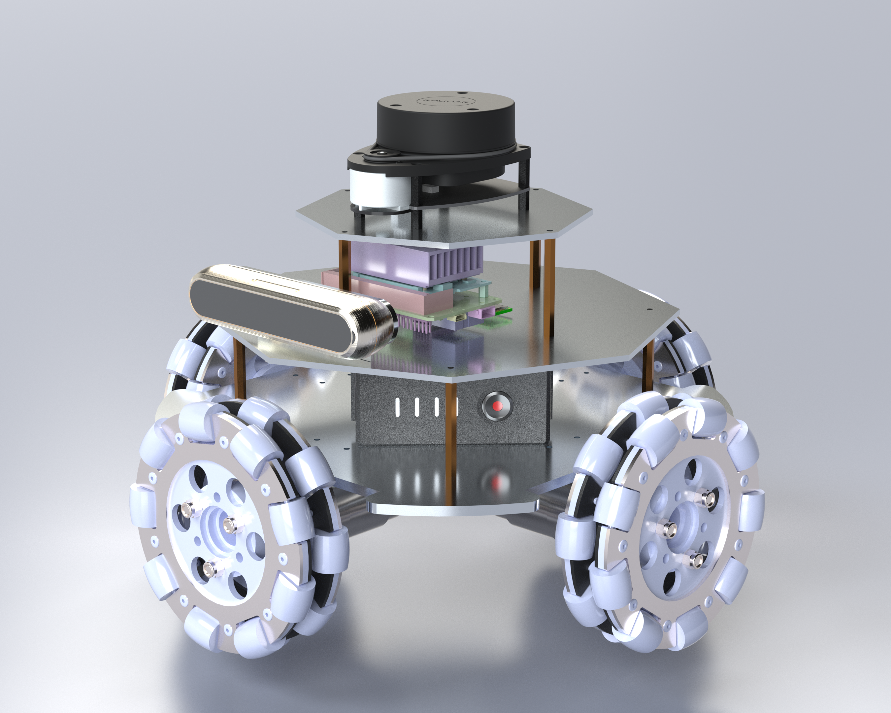
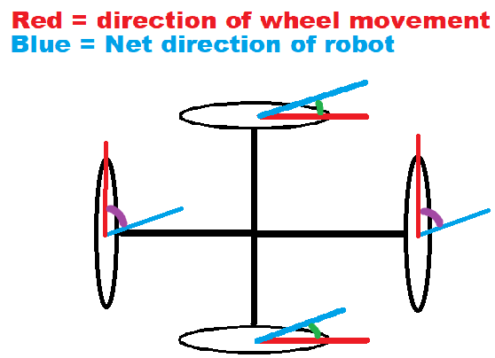

# SLAMurai Autonomous Robot

This project is an open-source implementation of a SLAM (Simultaneous Localization and Mapping) robot.  
All CAD and software is contained within this repo.

---

## Requirement Check

- [x] Omnidirectional movement using 4 dual-layer omniwheels  
- [x] Report odometry accurate to 3cm at 8ft range  
  - Last test: 12/20/2025 with 0.5% error in forward odom, within 3% error for side movement when moving 8ft straight. And 3cm off-center drift when doing pure diagonal.

---

## Features

- Real-time mapping (SLAM Toolbox)  
- Autonomous navigation (Nav2)  
- High-precision stepper-based odometry  

---

# Detailed Robot Design

## Payload

- 4x NEMA 17 Stepper Motors: 0.25kg each = 1.0kg total  
- 4x 60mm Omni wheels: 0.1kg each = 0.4kg total  
- 1x 6000mAh Lipo battery: 0.55kg  
- 1x NVIDIA Jetson Xavier NX: 0.2kg  
- 1x Intel RealSense D455: 0.3kg  
- 3x Chassis plates: 0.3kg total  
- 1x RPLIDAR A1: 0.2kg  

**Total weight: 3.5kg rounded**

---

## Desired robot specs

- Speed: 0.3 m/s  
- Acceleration: 0.5 m/s²  
- Max payload: 3.5 kg  
- Wheels: 60mm (0.0297m radius) omni wheels in 90° configuration  
- Worst case surface: Concrete (Rolling resistance ~0.03)  
- Torque safety factor: 2  

---

# Selecting Motor Parameters

## Required torque

$$
F_{\text{roll}} = \mu \cdot F_{\text{normal}} = 0.03 \cdot 3.5 \text{kg} \cdot 9.81 \text{m/s}^2 = 1.03 \text{N}
$$

$$
F_{\text{accel}} = 3.5 \text{kg} \cdot 0.5 \text{m/s}^2 = 1.75 \text{N}
$$

$$
F_{\text{total}} = 1.03 \text{N} + 1.75 \text{N} = \boxed{2.78 \text{N}}
$$

$$
\tau = F_{\text{total}} \cdot r_{\text{wheel}} = 2.78 \text{N} \cdot 0.0297 \text{m} = \boxed{0.082 \text{Nm}}
$$

This gives us the total torque required for the robot to meet our acceleration target. However, we need the worst-case torque per motor. One might assume it splits evenly between two motors when moving forward/backward or left/right. But could diagonal movement need more?

<p align="center">
  
</p>

If each motor provides torque $T$, the top/bottom motors contribute $2T\cos(\theta)$ and left/right motors $2T\cos(90^\circ - \theta)$, where $\theta$ is the angle of travel. We can solve for $T$ to achieve some total torque $\tau$:

$$
\tau = 2T\cos(\theta) + 2T\cos(90^\circ - \theta) \implies
T = \frac{\tau}{2(\cos(\theta) + \sin(\theta))}
$$

$T$ peaks when $\cos(\theta) + \sin(\theta)$ is minimized. We only consider $0 \leq \theta \leq 90^\circ$ since if the angle is $> 90^\circ$, we switch the direction of the top/bottom motors, yielding an angle $0 \leq \theta \leq 90^\circ$ again. Therefore the maximum of $T$ occurs when $\theta = 0^\circ$ or $90^\circ$. So yes, the worst case is moving purely along the top/bottom or left/right axes, splitting torque evenly:

$$
T = \frac{\tau}{2} = \frac{0.082 \text{Nm}}{2} = \boxed{0.041 \text{Nm}} \cdot 2_{\text{(safety factor)}} \approx \boxed{0.082 \text{Nm worst case per motor}}
$$

---

## Required RPM

$$
\text{RPM} = \frac{\text{Target velocity} \cdot 60}{2\pi r}
= \frac{0.3 \text{m/s} \cdot 60}{2\pi \cdot 0.0297 \text{m}}
\approx \boxed{96.5 \text{RPM}}
$$

---

## Motor & Driver Selection

- NEMA 17 Stepper Motors paired with an Arduino CNC Shield  
- 800 steps/rev (1/4 microstepping)  

Driver:

- A4988 or DRV8825 drivers  
- Up to 2A current capability  

Steppers provide high holding torque and precise positioning without needing external encoders. While they don't have current sensing, the open-loop nature of steppers is offset by our odometry integration.

---

# Battery Selection & Longevity

- Voltage: 12V (3S Lipo)  
- Desired Runtime: 1 hour  

## Total continuous current draw

- Motors: 0.4A each → 1.6A total  
- Jetson Xavier NX: ~15W @ 12V → 1.25A  
- RealSense D455: ~3.5W @ 5V → ~0.35A at 12V side  
- RPLIDAR A1: ~100mA  

$$
I_{\text{total}} \approx 1.6 + 1.25 + 0.35 + 0.1 = \boxed{3.3 \text{A}}
$$

To run for 1 hour:

$$
\text{Capacity} = I_{\text{total}} \cdot \text{Time}
= 3.3 \text{A} \cdot 1 \text{h}
= 3.3 \text{Ah}
= 3300 \text{mAh}
$$

Our 6000mAh battery is more than sufficient, providing a significant safety margin.

---

# Wheel Kinematics

We use inverse kinematics to command motor speeds from a target chassis twist and forward kinematics to compute odometry.

## Inverse Kinematics

$$
\begin{aligned}
\begin{bmatrix}
\omega_1\\
\omega_2\\
\omega_3\\
\omega_4
\end{bmatrix}
&=
\frac{1}{r}
\begin{bmatrix}
\sin(\gamma) & -\cos(\gamma) & -R \\
\sin\left(\frac{\pi}{2} + \gamma\right) & -\cos\left(\frac{\pi}{2} + \gamma\right) & -R \\
\sin(\pi + \gamma) & -\cos(\pi + \gamma) & -R \\
\sin\left(\frac{3\pi}{2} + \gamma\right) & -\cos\left(\frac{3\pi}{2} + \gamma\right) & -R
\end{bmatrix}
\begin{bmatrix}
v_{b,x}\\
v_{b,y}\\
\omega_{b,z}
\end{bmatrix}
\end{aligned}
$$

Where:

- $r = 0.0297\text{m}$  
- $R = 0.1325\text{m}$  
- $\gamma = 0$  

Simplified implementation (motor_controller.ino):

```
v_{Front} = -(v_y + R * omega)
v_{Left} = (v_x - R * omega)
v_{Back} = (v_y - R * omega)
v_{Right} = -(v_x + R * omega)
```

---

## Forward Kinematics

$$
\begin{aligned}
\begin{bmatrix}
v_{b,x}\\
v_{b,y}\\
\omega_{b,z}
\end{bmatrix}
&=
\begin{bmatrix}
0 & 0.5 & 0 & -0.5 \\
-0.5 & 0 & 0.5 & 0 \\
-\frac{1}{4R} & -\frac{1}{4R} & -\frac{1}{4R} & -\frac{1}{4R}
\end{bmatrix}
\begin{bmatrix}
\Delta s_1\\
\Delta s_2\\
\Delta s_3\\
\Delta s_4
\end{bmatrix}
\end{aligned}
$$

---

# Software Implementation

## Motor Control (Arduino)

The motor_controller.ino uses the MobaTools library for smooth, ramped stepper control.

- Serial Parsing: Reads $v_x$, $v_y$, $\omega$ at 40Hz  
- Speed Clamping: Ensures steps/sec never exceed STEPS_PER_SEC_MAX (2000 steps/s)  
- Odometry Integration: Calculates and broadcasts $x$, $y$, yaw over serial  

---

## Navigation Bridge (Python/ROS2)

The main.py node handles the Jetson-to-Arduino communication:

- Command Forwarding: Converts ROS Twist messages into serial strings  
- Odometry Publishing: Publishes nav_msgs/Odometry with appropriate covariances  

---

## Autonomous Navigation (Nav2)

Fully integrated with Nav2.

nav2_params.yaml limits:

```
max_vel_x: 0.25 m/s
max_vel_theta: 1.5 rad/s
```

This ensures reliable stepper performance without missing steps during complex maneuvers.

---

# License

MIT License
